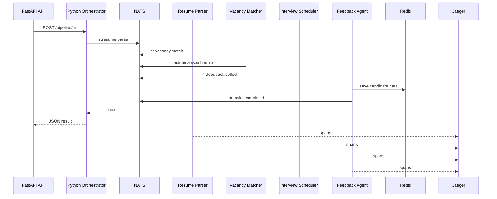

# Лабораторная работа №13: Мультиагентные системы: разработка распределённых интеллектуальных агентов

**Автор:** Кузьмищев Родион Ильич
**Группа:** 221331
**Вариант:** 8
**Предметная область:** Автоматизация HR
**Уровень:** задания повышенной сложности

## Цель

Освоить проектирование и реализацию мультиагентных систем (MAS), где агенты решают задачи из конкретной предметной области, взаимодействуют через брокер сообщений, а оркестратор управляет их работой.

## Предметная область: Автоматизация HR

Система автоматизирует процесс найма сотрудников, включая:
- Парсинг резюме
- Сопоставление кандидатов с вакансиями
- Планирование собеседований
- Сбор и анализ обратной связи

## Реализованная система

Проект представляет собой распределённую HR-систему. Go-агенты обрабатывают данные кандидатов по pipeline, Python-оркестратор запускает задачи, контролирует таймауты и предоставляет REST API.

| Компонент | Язык | Назначение |
|-----------|------|------------|
| resume-parser | Go | парсинг и нормализация резюме |
| vacancy-matcher | Go | сопоставление с вакансиями |
| interview-scheduler | Go | планирование собеседований |
| feedback-agent | Go | сбор обратной связи и сохранение состояния в Redis |
| orchestrator-api | Python/FastAPI | REST API, запуск pipeline, retry/timeout |
| llm-agent | Python | опциональное объяснение через Ollama |
| NATS | broker | обмен сообщениями |
| Redis | state storage | состояние агентов и кандидатов |
| Jaeger | tracing | распределённая трассировка |

## Выполненные задания повышенной сложности

### 1. Разработка полной системы из 3-5 агентов на Go

Реализованы 4 Go-агента: парсер резюме, сопоставитель вакансий, планировщик собеседований, агент обратной связи. Каждый агент работает как отдельный микросервис и взаимодействует через NATS.

### 2. Цепочки задач (pipeline)

Реализована последовательная обработка:

```
hr.resume.parse -> hr.vacancy.match -> hr.interview.schedule -> hr.feedback.collect -> hr.tasks.completed
```

### 3. Распределённая трассировка (Jaeger)

В Go-агенты и Python-оркестратор добавлен OpenTelemetry. Jaeger поднимается через Docker Compose и доступен на `http://localhost:16686`.

### 4. Агент с состоянием (Redis)

Агент `feedback-agent` сохраняет результаты в Redis:

```
hr:candidate:{id} -> hash(score, recommendation, updated_at)
hr:total_candidates_processed -> counter
hr:processed_tasks -> counter
```

### 5. Динамическое масштабирование

Подготовлен скрипт `scripts/scale_agents.py`, который масштабирует экземпляры агентов через Docker Compose. NATS queue groups распределяют задачи между репликами.

### 6. Аукционное распределение задач

Оркестратор может публиковать запрос `hr.auction.bid_request`, агенты возвращают bid с `cost`, `skill`, `availability`. Оркестратор выбирает подходящего исполнителя.

### 7. Интеграция LLM-агента

Добавлен Python LLM-агент `orchestrator/llm_agent.py`. Он может формировать объяснение результатов через локальную Ollama при заданной переменной `OLLAMA_URL`.

### 8. Веб-интерфейс для мониторинга агентов

FastAPI + Jinja2 панель доступна на `http://localhost:8000/`. Она показывает статус подключения, метрики обработки и форму для запуска HR-пайплайна.

## Архитектура



## Структура проекта

```
lab-13-var8/
├── agents/                 # Go-микросервисы агентов
│   ├── parser/            # Парсер резюме
│   ├── matcher/           # Сопоставитель вакансий
│   ├── scheduler/         # Планировщик собеседований
│   ├── feedback/          # Агент обратной связи
│   └── Dockerfile.*       # Dockerfiles для каждого агента
├── internal/hr/           # общие Go-типы, логика, тесты
├── orchestrator/          # Python-оркестратор, FastAPI, LLM-агент
├── scripts/               # демо-запрос и масштабирование
├── tests/                 # pytest для оркестратора
├── web/templates/         # HTML-панель мониторинга
├── docs/                  # описание ролей агентов
├── docker-compose.yml
├── Dockerfile.python
├── go.mod
├── go.sum
├── requirements.txt
├── pytest.ini
├── PROMPT_LOG.md
└── README.md
```

## Быстрый старт

```powershell
# Запуск всей системы
docker compose up --build
```

После запуска доступны:

- API и мониторинг: `http://localhost:8000`
- Swagger: `http://localhost:8000/docs`
- Jaeger: `http://localhost:16686`
- NATS monitoring: `http://localhost:8222`

### Демо-запрос

```powershell
.\scripts\run_demo.ps1
```

Пример ручного запроса:

```powershell
Invoke-RestMethod -Method Post -Uri "http://localhost:8000/pipeline/hr" -ContentType "application/json" -Body '{
  "candidate_name": "Иван Петров",
  "raw_resume": "Имя: Иван Петров\nEmail: ivan@example.com\nНавыки: Go, Python, Docker",
  "vacancy_title": "Go Backend Developer"
}'
```

## Масштабирование

```bash
python .\scripts\scale_agents.py --parsers 3 --detectors 2
```

## Тестирование

Go-тесты:

```bash
go test ./...
```

Python-тесты:

```bash
python -m pip install -r requirements.txt
python -m pytest
```

Проверенный результат:

```
go test ./...      -> ok
python -m pytest   -> passed
docker compose build -> success
demo request -> pipeline completed, candidate processed
```

## Основные файлы

| Файл | Назначение |
|------|------------|
| PROMPT_LOG.md | журнал промптов и этапов выполнения |
| docs/agent_roles.md | роли, входы/выходы и бизнес-правила агентов |
| tests/test_orchestrator.py | pytest для Python-оркестратора |
| internal/hr/hr_test.go | Go unit-тесты логики HR |
| docker-compose.yml | инфраструктура NATS, Redis, Jaeger, API и Go-агентов |

## Используемые технологии

- **Go 1.21** - агенты на Go с nats.go
- **Python 3.11** - оркестратор с FastAPI, nats-py
- **NATS** - брокер сообщений
- **Redis** - хранилище состояния
- **Jaeger** - распределённая трассировка
- **Docker Compose** - контейнеризация
- **OpenTelemetry** - трассировка
